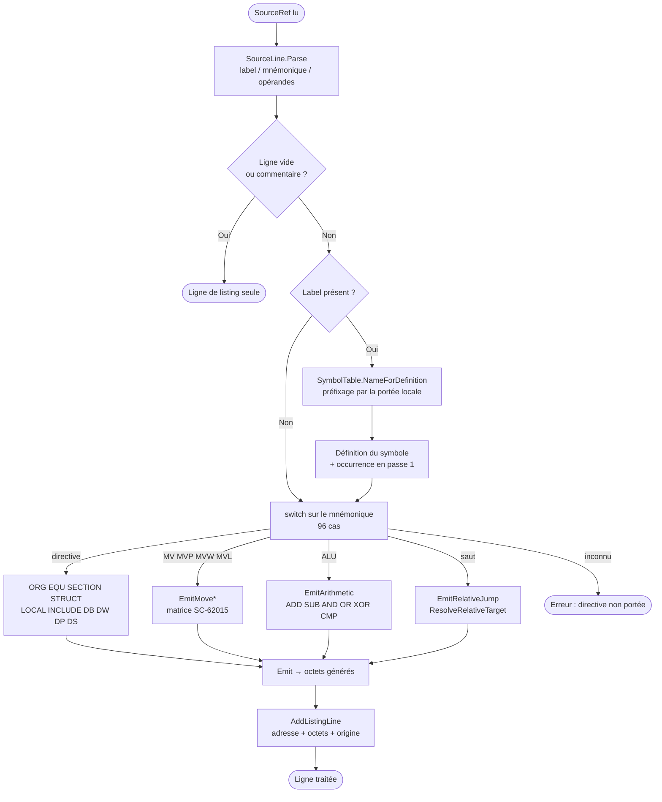

# XASM 2026-4

**Assembleur croisé absolu pour le CPU SC-62015 (Sharp PC-E500S) — portage C# natif**

```
<<< XASM Ver2026-4 for CPU-SC62015 / (c)1990-1996 N.Kon and E.Kako >>>
<<< Updated by Jean-Francois Albouy, 2026 >>>
```

---

## Table des matières

1. [Présentation](#présentation)
2. [Historique](#historique)
3. [Logigramme général](#logigramme-général)
4. [Prérequis et compilation](#prérequis-et-compilation)
5. [Utilisation](#utilisation)
6. [Options](#options)
7. [Structure du code source](#structure-du-code-source)
8. [Syntaxe assembleur](#syntaxe-assembleur)
9. [Directives](#directives)
10. [Avertissements](#avertissements)
11. [Formats de sortie](#formats-de-sortie)
12. [Exemples](#exemples)
13. [Non-régression et tests](#non-régression-et-tests)
14. [Intégration Visual Studio et VS Code](#intégration-visual-studio-et-vs-code)
15. [Écarts connus avec le moteur C](#écarts-connus-avec-le-moteur-c)
16. [Licence et crédits](#licence-et-crédits)

---

## Présentation

XASM est un assembleur croisé pour le microprocesseur **SC-62015** utilisé dans les
ordinateurs de poche **Sharp PC-E500 / PC-E500S**. Il transforme du code source assembleur
(`.ASM` / `.S`) en fichiers objets binaires prêts à être chargés sur la machine cible.

**`xasm2026-4` est un portage C# / .NET 8 autonome** du moteur C historique. Il ne
l'encapsule pas : le cœur assembleur est réécrit en C#, tandis que le code C d'origine est
conservé dans `Reference/C/` comme source d'autorité.

> **La contrainte qui gouverne tout le projet est la non-régression octet à octet.**
> Toute sortie produite par `xasm2026-4` doit être rigoureusement identique à celle de
> l'assembleur de référence `xasm2026-1`. Cette exigence prime sur l'élégance du code :
> quand un doute d'encodage apparaît, le C de `Reference/C/` fait foi.

La documentation et les commentaires du code sont en français ; cette convention est à
conserver lors de toute modification.

---

## Historique

| Version | Auteur | Langage | Époque |
|---|---|---|---|
| XASM 1.0 | N. Kon | Turbo Pascal | 1990-1993 |
| XASM 1.40 | E. Kako | C (ANSI) | 1995-1996 |
| XASM 2026-1 | J.-F. Albouy | C11 (moderne) | 2026 |
| XASM 2026-2 | J.-F. Albouy | C# encapsulant le moteur C | 2026 |
| **XASM 2026-4** | **J.-F. Albouy** | **C# / .NET 8 natif** | **2026** |

`xasm2026-1` reste la **référence fonctionnelle** : c'est contre ses sorties que la
conformité est mesurée. `xasm2026-2` fut l'étape de transition (wrapper C# autour du moteur
C), dont la trace est conservée dans `Reference/CSharpWrapper/`.

---

## Logigramme général

### Vue d'ensemble

Contrairement au moteur C historique qui effectue **trois passes**, le portage C# en réalise
**deux** : la résolution des symboles et le calcul des adresses convergent en une seule
passe, la passe de résolution des `EQU` différés du C étant absorbée par l'évaluation à la
demande.

```mermaid
flowchart TD
    A([Démarrage]) --> B[Usage.WriteTitle<br/>bannière]
    B --> C[CommandLineOptions.Parse<br/>source + options]
    C --> D{Source<br/>fourni ?}
    D -- Non --> ERR([Usage.Write<br/>code retour 1])
    D -- Oui --> PRE

    subgraph PRE["PRÉPROCESSEUR"]
        direction TB
        PRE1[ReadSourceWithIncludes<br/>résolution des INCLUDE<br/>détection de cycle] --> PRE2
        PRE2[Chaque ligne devient un SourceRef<br/>Text + File + Line] --> PRE3
        PRE3[ExpandSource<br/>macros, REPEAT, conditionnelles]
    end

    PRE --> P1

    subgraph P1["PASSE 1 — RunPass emit:false"]
        direction TB
        P1A[Parcours des lignes développées] --> P1B[Calcul des adresses<br/>compteur de localisation]
        P1B --> P1C[Définition des symboles<br/>SymbolTable]
        P1C --> P1D[Enregistrement des occurrences<br/>pour les sauts relatifs]
    end

    P1 --> P2

    subgraph P2["PASSE 2 — RunPass emit:true"]
        direction TB
        P2A[Même parcours] --> P2B[Encodage effectif<br/>méthodes Emit*]
        P2B --> P2C[Un symbole non résolu<br/>devient une erreur fatale]
        P2C --> P2D[Construction du listing<br/>et des sections]
    end

    P2 --> OUT

    subgraph OUT["SORTIES"]
        direction LR
        O1["-O → .obj"]
        O2["-L → .lst"]
        O3["-I → .hex"]
        O4["-M → .s19"]
        O5["-P → .map"]
        O6["-D → .d"]
        O7["-B → .uu"]
        O8["-X → .txt"]
        O9["-E → .err"]
    end

    OUT --> FIN([No fatal error<br/>Code : début - fin])
```



Le drapeau `_emitPass` distingue les deux passes : un symbole indéfini n'est signalé qu'en
passe d'émission, puisque avant cela il peut encore être défini plus loin dans le source.

### Zoom : traitement d'une ligne



---

## Prérequis et compilation

### Dépendances

- **SDK .NET 8**
- Aucune dépendance externe : le projet n'utilise que la bibliothèque standard.

### Compilation

```powershell
dotnet build .\src\Xasm2026.Native.csproj -c Release
```

L'exécutable canonique est produit dans :

```text
src\bin\Release\net8.0\xasm2026-4.exe
```

Une copie de commodité est maintenue à la racine :

```text
bin\xasm2026-4.exe
```

> `bin\` est une copie **recopiée à la main**. Après une modification significative,
> reconstruire puis recopier le binaire frais si l'on s'appuie dessus.

---

## Utilisation

```
xasm2026-4 sourcefile[.ext] [options]
```

Si le fichier source n'a pas d'extension, `.asm` est ajoutée automatiquement.

> **Important** : lancer l'assembleur depuis le répertoire du fichier source, afin que les
> directives `INCLUDE` se résolvent correctement.

### Exemples rapides

```powershell
# Assemblage simple : objet + listing + table des symboles
cd .\Exemples\SAMPLES
..\..\bin\xasm2026-4.exe SAMPLE5.ASM -O -L -S

# Toutes les sorties sur un projet multi-fichiers
cd .\Exemples\VOGUE
..\..\bin\xasm2026-4.exe VOGUE.S -O vogue.obj -L vogue.lst -I -M -P -D -B -X -S -R
```

---

## Options

Chaque type de sortie est **optionnel et explicite**. Le nom de fichier peut être collé à
l'option (`-Lfoo.lst`) ou séparé par une espace (`-L foo.lst`) ; s'il est omis, le nom du
source est repris avec la nouvelle extension.

| Option | Description |
|---|---|
| `-O[fichier]` | Génère le fichier objet (`.obj`) |
| `-L[fichier]` | Génère le fichier listing (`.lst`) |
| `-E` | Génère le rapport d'erreurs (`.err`) |
| `-S` | Ajoute la table des symboles au listing (avec `-L`) |
| `-T[type]` | Type d'objet : `Z`=ZSH, `B`=binaire, `H`=hexadécimal, `F`=FTX, autre=binaire+en-tête |
| `-C` | Affiche le compteur de lignes |
| `-W` | Affiche les avertissements (voir [Avertissements](#avertissements)) |
| `-H` | Désactive le hachage pour le listing des symboles |
| `-I[fichier]` | Sortie **Intel HEX** (`.hex`) |
| `-M[fichier]` | Sortie **Motorola S-Record** (`.s19`) |
| `-P[fichier]` | **MAP** des symboles et sections (`.map`) |
| `-D[fichier]` | Fichier de **dépendances Make** (`.d`) |
| `-B[fichier]` | Programme **BASIC auto-décodable** (`.uu`) pour PC-E500S |
| `-X[fichier]` | **Dump hexadécimal** style HxD (`.txt`) |
| `-V` | Mode verbeux : ajoute la colonne aux diagnostics |
| `-R` | Rapport de taille des sections |
| `-?` | Affiche l'aide |

Les options sont analysées dans `src/CommandLineOptions.cs`.

---

## Structure du code source

```text
src/
  Program.cs                        Point d'entrée, orchestration des sorties
  CommandLineOptions.cs             Analyse de la ligne de commande
  Usage.cs                          Bannière (title) et aide (usage)

  Assembly/
    NativeAssembler.cs              Coeur : boucle deux passes, dispatch, encodeurs Emit*
    NativeAssembler.Preprocessor.cs INCLUDE, macros, REPEAT, conditionnelles
    NativeAssembler.Expressions.cs  Évaluation, cibles relatives
    NativeAssembler.Sections.cs     STRUCT, sections, recopie du résultat
    SymbolTable.cs                  Symboles, occurrences, portées locales
    RegisterTable.cs                Tables registre/opcode SC-62015
    SourceLine.cs                   Découpage label / mnémonique / opérandes
    SourceRef.cs                    Ligne source + son origine physique

  Expressions/
    ExpressionEvaluator.cs          Évaluation numérique sur la table des symboles

  Core/                             Porteurs de données
    AssemblyResult.cs               Octets, symboles, sections, listing, avertissements
    GeneratedByte.cs   ListingLine.cs   SectionInfo.cs   AssemblyWarning.cs

  Outputs/                          Un rédacteur par format
    ObjectWriter.cs    ListingWriter.cs    IntelHexWriter.cs   SRecordWriter.cs
    MapWriter.cs       DependencyWriter.cs BasicUuWriter.cs    HxdDumpWriter.cs

tests/Xasm2026.Tests/               Harnais xUnit de non-régression
Exemples/                           Sources et sorties de référence
Reference/C/                        Sources C d'origine (autorité en cas de doute)
Reference/CSharpWrapper/            Trace de l'étape xasm2026-2
tools/                              Comparaison avec la référence, génération de doc
```

`NativeAssembler` est une **classe `partial`** répartie par préoccupation. Ce découpage a
été choisi précisément parce qu'il ne modifie aucun site d'appel — un impératif quand la
moindre régression se mesure à l'octet près.

### Correspondance avec les sources C

| Module C | Équivalent C# |
|---|---|
| `xasm.c` | `Program.cs`, boucle de `NativeAssembler` |
| `eval.c` | `Expressions/ExpressionEvaluator.cs` |
| `opr.c`, `mvopr.c`, `genop.c` | Méthodes `Emit*` de `NativeAssembler.cs` |
| `hash.c` | `Assembly/SymbolTable.cs` |
| `misc.c` | `Outputs/ListingWriter.cs`, `Outputs/ObjectWriter.cs` |
| `modern.c` | Autres rédacteurs de `Outputs/` |
| `mes.c` | `Usage.cs`, `Core/AssemblyWarning.cs`, rapports de `Program.cs` |

`PORTAGE.md` tient le journal daté et détaillé de ce qui a été porté et vérifié.

---

## Syntaxe assembleur

### Format d'une ligne

```
[LABEL:]   MNEMONIC  OPERANDES    ; commentaire
```

- Les **labels** se terminent par `:` — ce deux-points est **obligatoire**, y compris
  devant `EQU`.
- Les **mnémoniques** et **directives** sont insensibles à la casse.
- Le **point-virgule** ouvre un commentaire jusqu'en fin de ligne.

### Constantes numériques

C'est le **dernier caractère** du jeton qui fixe la base, comme dans `eval.c` :

| Format | Exemple | Suffixe / préfixe |
|---|---|---|
| Décimal | `1234`, `1234D` | `D` ou aucun (base par défaut) |
| Hexadécimal | `0FF00H` | Suffixe `H` |
| Hexadécimal | `$FF00` | Préfixe `$` |
| Binaire | `10110101B` | Suffixe `B` |
| Octal | `377O` | Suffixe `O` |
| Caractère | `'A'` | Valeur ASCII, dans `DB` / `DM` |

Les suffixes sont acceptés en majuscule comme en minuscule. Le souligné `_` est un
séparateur visuel ignoré : `1010_1010B`, `0F_FH`, `1_000`.

> Un nombre commence obligatoirement par un **chiffre** ou par `$` ; un jeton commençant par
> une lettre est un nom de symbole. C'est la raison pour laquelle l'hexadécimal exige un zéro
> de tête : `0FFH` et non `FFH`.
>
> Un chiffre supérieur ou égal à la base invalide le jeton (`2B`, `8O`), qui est alors traité
> comme un symbole — et donc signalé comme indéfini.

### Registres du SC-62015

| Nom | Description |
|---|---|
| `A` | Accumulateur 8 bits |
| `B` | Registre B 8 bits |
| `BA` | Registre BA 16 bits (B:A) |
| `IL` | Registre d'index bas 8 bits |
| `I` | Registre d'index 20 bits |
| `X`, `Y` | Registres d'adresse 20 bits |
| `U` | Pointeur utilisateur 20 bits |
| `S` | Pointeur de pile système 20 bits |
| `F` | Registre de drapeaux |
| `IMR` | Registre de masque d'interruption |

### Modes d'adressage

| Syntaxe | Mode |
|---|---|
| `A` | Registre direct |
| `1234H` | Immédiat / absolu |
| `(BP+10)` | RAM interne, BP + déplacement |
| `(PX+2)`, `(PY+2)` | RAM interne via PX / PY |
| `(BP+PX)` | Somme de pointeurs |
| `(#40H)` | Adresse immédiate interne |
| `[X]` | Indirect via registre |
| `[X++]` | Post-incrémentation |
| `[--U]` | Pré-décrémentation |
| `[X+5]`, `[Y-6]` | Indirect avec déplacement |
| `[(20H)]`, `[(20H)+1]` | Indirect via pointeur en RAM interne |

### Expressions

Les opérateurs portés, **du moins prioritaire au plus prioritaire** :

| Niveau | Opérateurs |
|---|---|
| 3 | `\|` — OU binaire |
| 4 | `&` — ET binaire |
| 5 | `%` — modulo |
| 6 | `+` `-` |
| 7 | `*` `/` |

Les parenthèses forcent le regroupement. Une **division ou un modulo par zéro est une erreur
fatale** (code 2 du moteur C) : l'assemblage s'arrête et aucun objet n'est écrit, plutôt que
de produire silencieusement un `0`.

> **Attention** : le modulo lie **moins fort que l'addition** dans ce langage, contrairement
> au C. `1+2%3` vaut donc `(1+2)%3` = 0, et non `1+(2%3)` = 3. Cette précédence est celle de
> `oprlevel_set` dans `init.c`.

Ils opèrent sur les constantes et les symboles. Les mnémoniques de registres (`BP`, `PX`,
`A`, …) valent `0` dans une expression d'adressage : leur contribution est encodée dans
l'opcode, ils ne sont donc jamais considérés comme des symboles indéfinis.

### Compteur de localisation

Le symbole `*` désigne le **compteur de localisation** : l'adresse à laquelle l'assemblage
est en train de se faire.

```asm
here:   DP  *          ; adresse de cette ligne
        DP  *+2        ; adresse courante décalée de 2
        DB  4*3        ; ici, "*" reste la multiplication
```

Les deux emplois ne peuvent pas être confondus : `*` en **position de terme** vaut le
compteur, `*` **entre deux valeurs** est l'opérateur de multiplication — c'est la règle du
drapeau `set_x` de `eval.c`. L'écriture `**2` est donc valide et vaut « compteur × 2 ».

### Symboles locaux

Un label défini dans un bloc `LOCAL` est préfixé par la portée courante
(`portée!label`). La référence `..!nom` désigne la **portée parente**, et les blocs
s'imbriquent. Ces règles sont isolées dans `SymbolTable` et couvertes par des tests
unitaires dédiés.

---

## Directives

### Organisation

| Directive | Description |
|---|---|
| `ORG expr` | Fixe le compteur de localisation |
| `LABEL: EQU expr` | Définit une constante symbolique |
| `END` | Fin du fichier source courant |
| `INCLUDE fichier` | Inclut un fichier source |
| `SECTION nom` | Débute une section nommée |

> Un `END` situé dans un fichier **inclus** ne termine pas l'assemblage global : il ne
> ferme que ce fichier. Ce comportement est intentionnel et doit être préservé.

`INCLUDE` accepte jusqu'à dix arguments, référencés par `@0`…`@9` dans le fichier inclus :

```asm
        INCLUDE subfunc.asm, 100H, 200H
; dans subfunc.asm :
;   MV X, @0    ; = 100H
;   MV Y, @1    ; = 200H
```

Une référence `@n` au-delà des arguments reçus est une erreur explicite.

### Données

| Directive | Description |
|---|---|
| `DB expr[,…]` | Octets |
| `DM 'chaîne'` | Chaîne de caractères |
| `DW expr[,…]` | Mots 16 bits |
| `DP expr[,…]` | Pointeurs 20 bits |
| `DS n[,val]` | Réserve `n` octets initialisés à `val` |
| `PRE octet` | Émet un prebyte explicite (21h-27h ou 30h-37h) |

### Portées, macros, structures

```asm
funcname:
        LOCAL
loop:   ...          ; label local à ce bloc
        ENDL

        MACRO  emit_marker,value
        DB     value
        ENDM

        emit_marker $7E

        REPEAT 4
        NOP
        ENDR

        STRUCT work
w_a:    DS  1
w_b:    DS  2
        ENDS
```

| Directive | Description |
|---|---|
| `LOCAL` / `ENDL` | Ouvre / ferme un bloc de portée locale |
| `SCOPE_ON` / `SCOPE_OFF` | Recherche dans les portées parentes |
| `MACRO` / `ENDM` | Définition de macro |
| `REPEAT n` / `ENDR` | Répétition d'un bloc |
| `STRUCT` / `ENDS` | Structure de données |

### Assemblage conditionnel

| Directive | Description |
|---|---|
| `DEF sym` / `UNDEF sym` | Définit / supprime un symbole conditionnel |
| `IFDEF` / `IFNDEF` | Test d'existence de symbole |
| `IFEQ` / `IFNE` | Test d'égalité / différence à zéro |
| `IFGT` / `IFLT` | Test strictement positif / négatif |
| `ELSE` / `ENDIF` | Branche alternative / fin de bloc |

### Gestion des prebytes

| Directive | Description |
|---|---|
| `PRE_ON` / `PRE_OFF` | Active / désactive l'émission automatique des prebytes |
| `PRE_PUSH` / `PRE_POP` | Sauvegarde / restaure l'état PRE sur une pile |

---

## Avertissements

Les **six** avertissements non fatals du moteur C sont portés :

| Code | Message | Déclencheur |
|---|---|---|
| 28 | `Warning: Location counter already set` | `ORG` après que l'origine a déjà été fixée |
| 29 | `Warning: Used PRE while auto-prebyte is active` | `PRE` alors que `PRE_ON` est actif |
| 32 | `Warning: No effective code` | `DS 0`, qui ne réserve rien |
| 33 | `Warning: LOCAL and ENDL not match in included file` | Déséquilibre `LOCAL`/`ENDL` dans un `INCLUDE` |
| 34 | `Warning: INCLUDE argument isn't defined yet` | Argument d'`INCLUDE` non résoluble |
| 38 | `Warning: PRE_PUSH and PRE_POP not match` | Déséquilibre `PRE_PUSH`/`PRE_POP` dans un `INCLUDE` |

Comme dans le C, un avertissement ne rend **jamais** l'assemblage fatal et reste **muet sans
`-W`**. Sous `-W`, il est affiché sur la console, ajouté au `.err`, et **intercalé dans le
listing juste après la ligne fautive** :

```
00E001                  	        ds  0
warn.asm	3	col 13	Warning: No effective code
```

Le format est `fichier<TAB>ligne<TAB>texte`, avec `col N` inséré sous `-V`. Les numéros
rapportés sont ceux de la **ligne physique** du fichier réellement fautif, y compris à
travers les `INCLUDE` ; une ligne issue d'une macro est rattachée à son **site d'appel**.

---

## Formats de sortie

### Objets binaires (`-O`)

Contrôlé par `-T` :

| Type | Format |
|---|---|
| (défaut) | Binaire avec en-tête 16 octets Sharp |
| `-TZ` | Format ZSH pour E500 (ASCII hexadécimal) |
| `-TB` | Binaire pur, sans en-tête |
| `-TH` | Hexadécimal ASCII |
| `-TF` | Format FTX |

### Formats modernes

| Option | Extension | Description |
|---|---|---|
| `-I` | `.hex` | Intel HEX |
| `-M` | `.s19` | Motorola S-Record |
| `-P` | `.map` | MAP des symboles et sections |
| `-D` | `.d` | Dépendances Makefile |
| `-B` | `.uu` | Programme BASIC PC-E500S auto-décodable |
| `-X` | `.txt` | Dump hexadécimal style HxD |

Le générateur `.uu` reproduit fidèlement le comportement de `uuselfx.c` : tampon de
45 octets conservé sur le dernier bloc, checksum historique et ligne `size` finale.

### Déterminisme

Les formats `.obj`, `.hex`, `.s19` et `.txt` sont **indépendants du nom de fichier de
sortie**. Les formats `.lst`, `.map`, `.d` et `.uu` embarquent le nom du source et des
sorties ; ils ne sont donc reproductibles octet à octet qu'en rejouant l'invocation exacte.
Le seul champ non déterministe de l'ensemble est la ligne `' Submitted jj/mm/aaaa` du `.uu`.

---

## Exemples

Le répertoire `Exemples/` contient quatre projets de référence, accompagnés de leurs
sorties attendues.

| Projet | Source | Lignes | Code généré | Démontre |
|---|---|---:|---:|---|
| SAMPLES | `SAMPLE1`…`SAMPLE5.ASM` | 26–87 | 30 o (SAMPLE5) | `LOCAL`, macros, conditionnelles, `SECTION`, `REPEAT`, `STRUCT` |
| REGISTER | `REGISTER.ASM` | 922 | 4 154 o | Driver PC-E500S : appels BASIC, interruptions, copie de blocs |
| TMAP | `TMAP2020.asm` | 875 | 1 744 o | E/S fichiers, affichage, énumération de périphériques |
| VOGUE | `VOGUE.S` + `runtime.s` + `compile.s` | 4 496 | 14 433 o | Compilateur complet multi-fichiers |

```powershell
cd .\Exemples\VOGUE
..\..\bin\xasm2026-4.exe VOGUE.S -O vogue.obj -L vogue.lst -S -I -M -P -D -R
```

`tests/coverage_all.asm` (avec `coverage_all_include.asm`) exerce méthodiquement chaque
forme de directive et d'opcode portée ; c'est le fichier à enrichir lors de l'ajout d'une
instruction.

---

## Non-régression et tests

C'est le coeur du flux de travail du projet.

```powershell
dotnet test .\tests\Xasm2026.Tests\Xasm2026.Tests.csproj -c Release
```

- **`GoldenAssemblyTests`** réassemble SAMPLE5, VOGUE, REGISTER et TMAP2020 dans un
  répertoire temporaire et compare les **huit** sorties (`.obj`, `.hex`, `.s19`, `.txt`,
  `.lst`, `.map`, `.d`, `.uu`) **octet à octet** aux fichiers de référence de `Exemples/` —
  soit 32 comparaisons exactes.
- **`BehaviorTests`** couvre les garde-fous : symbole indéfini, inclusion cyclique,
  avertissements, numéros de ligne physiques, intercalage dans le listing.
- **`SymbolTableTests`** couvre les règles de portée locale, la partie la plus subtile du
  portage.

Les formats de présentation n'étant reproductibles qu'avec l'invocation d'origine, le
harnais rejoue celle-ci exactement : **noms de fichiers entièrement en minuscules**
(`sample5.asm` → `sample5.lst`) **et option `-S`**. La date du `.uu` est neutralisée avant
comparaison.

`.github/workflows/ci.yml` exécute compilation et tests à chaque push sur
**windows-latest** — les noms en minuscules ne résolvent les fichiers réels que sur un
système de fichiers insensible à la casse, et les formats texte y évitent toute dérive de
fins de ligne.

`tools/compare_with_xasm2026_1_1.ps1` compare directement les sorties de la référence et du
candidat. L'exécutable `xasm2026-1` n'étant pas fourni dans ce dépôt, il faut le désigner :

```powershell
.\tools\compare_with_xasm2026_1_1.ps1 -ReferenceXasm C:\chemin\vers\xasm2026-1.exe
```

---

## Intégration Visual Studio et VS Code

- `xasm2026-4.sln` (et `xasm2026-4.slnx` au nouveau format) pour Visual Studio 2022.
- `src/Properties/launchSettings.json` fournit quatre profils de lancement prêts à
  l'emploi (VOGUE, REGISTER, couverture complète), avec des chemins **relatifs au projet**.
- `.vscode/tasks.json` expose les flux courants : `build xasm2026-4`, `assembler VOGUE`,
  `assembler REGISTER`, `coverage_all toutes options`.

Voir `Documentation/Utilisation_Visual_Studio_2022_Insiders.md` pour le détail.

---

## Écarts connus avec le moteur C

Ces écarts sont documentés plutôt que masqués. Aucun n'affecte les sorties machine des
exemples de référence.

| Domaine | Écart |
|---|---|
| Avertissement 34 | Implémenté, mais peu atteignable : voir ci-dessous |
| Colonne `-V` | Désigne le début de l'opérande fautif, et non la position courante de l'analyseur (`pp` du C) |

**Sur l'avertissement 34.** Il est implémenté mais rarement observable, à cause d'une
différence d'architecture : le préprocesseur du portage évalue tous les `EQU` avant les
passes, si bien qu'un symbole défini *plus loin* dans le source est déjà connu — la notion de
« pas encore défini », qui dépend de l'ordre de lecture dans le C, disparaît en grande partie.
Et si le symbole n'est défini nulle part, son emploi via `@n` déclenche d'abord une **erreur
fatale** de symbole indéfini, plus utile qu'un avertissement. L'avertissement ne remonte donc
que lorsque l'argument fautif n'est jamais utilisé dans le fichier inclus.

Les mnémoniques ou formes d'adressage non encore portés provoquent une erreur explicite
(`opcode ou directive non encore portee: …`) plutôt qu'un encodage silencieusement faux.

---

## Licence et crédits

```
XASM original    Copyright (c) 1990-1993 N. Kon (Turbo Pascal)
XASM 1.40        Copyright (c) 1995-1996 E. Kako (C)
XASM 2026-4      Updated by Jean-François Albouy, 2026
```

Ce logiciel est distribué pour usage personnel et éducatif avec les machines
Sharp PC-E500 / PC-E500S.

---

## Références

- [`CLAUDE.md`](CLAUDE.md) — guide de contribution et architecture détaillée
- [`PORTAGE.md`](PORTAGE.md) — journal daté du portage, module par module
- [`xasm2026-4.md`](xasm2026-4.md) — note de cadrage du portage
- [`Documentation/Documentation_XASM2026-4_PC-E500S.md`](Documentation/Documentation_XASM2026-4_PC-E500S.md) — documentation complète, jeu d'instructions en annexe
- [`Reference/C/`](Reference/C/) — sources C d'origine, autorité en cas de doute d'encodage
